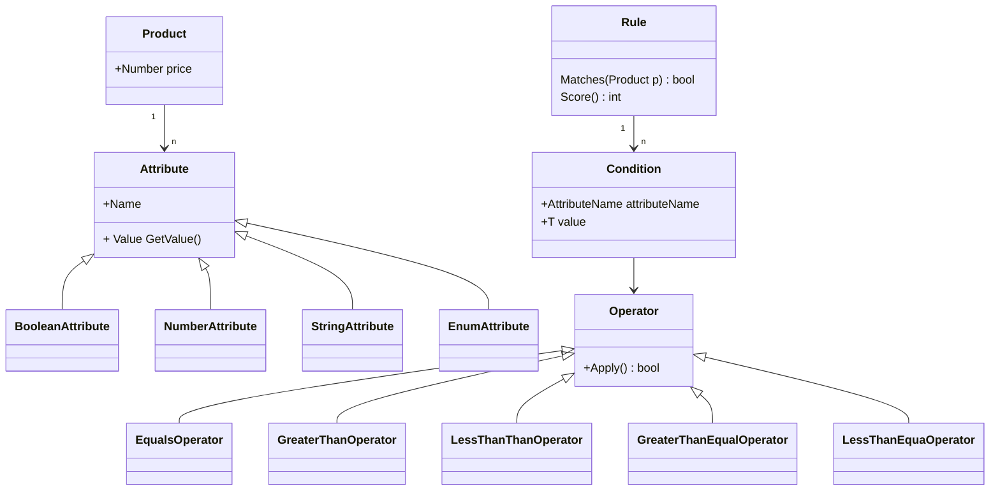

UML Diagram

```mermaid
classDiagram
    Product "1" --> "n" Attribute
    Attribute <|-- BooleanAttribute
    Attribute: + Value GetValue()
    Attribute: +Name
    Attribute <|-- NumberAttribute
    Attribute <|-- StringAttribute
    Attribute <|-- EnumAttribute

    Rule "1" -->"n" Condition
    Condition --> Operator

    Operator <|-- EqualsOperator
    Operator <|-- GreaterThanOperator
    Operator <|-- LessThanThanOperator
    Operator <|-- GreaterThanEqualOperator
    Operator <|-- LessThanEquaOperator


    
   class Condition{
        +AttributeName attributeName
        +T value
   }

   class Rule{
    
   }

  class Operator{

    +Apply() bool
  }
 
 class Product{
    +Number price
    }
  
  class Rule{
    Matches(Product p) bool
    Score() int
  }

 

```